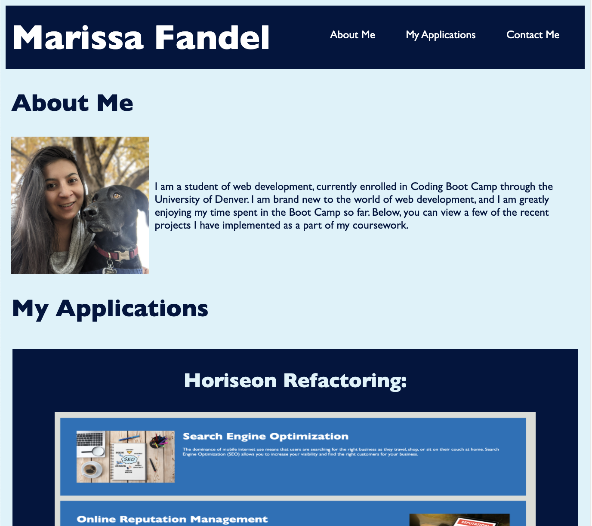

# Professional Portfolio - Marissa Fandel

## Description

The goal of this project is to provide a professional portfolio for potential employers to review, in order to learn more about my deployed web applications.

## Features

- Formatting adjusts to different screen sizes to allow user to view page clearly on multiple devices

* Nav bar with links to the different sections in the Portfolio

* Clicking the photos in the "My Applications" section takes user directly to those deployed applications

* Links to send me an email or view my GitHub repos

## Screenshot

## Link to GitHub Repo

https://github.com/mfandel118/Homework-2
